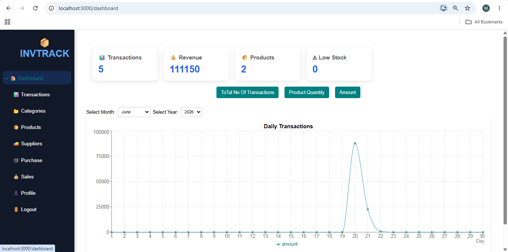
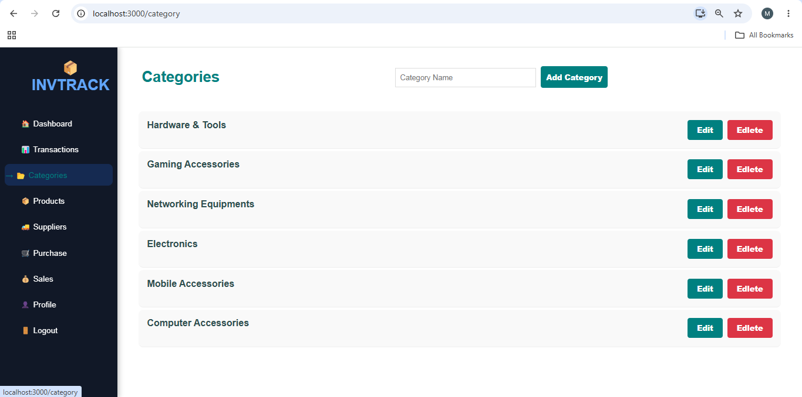
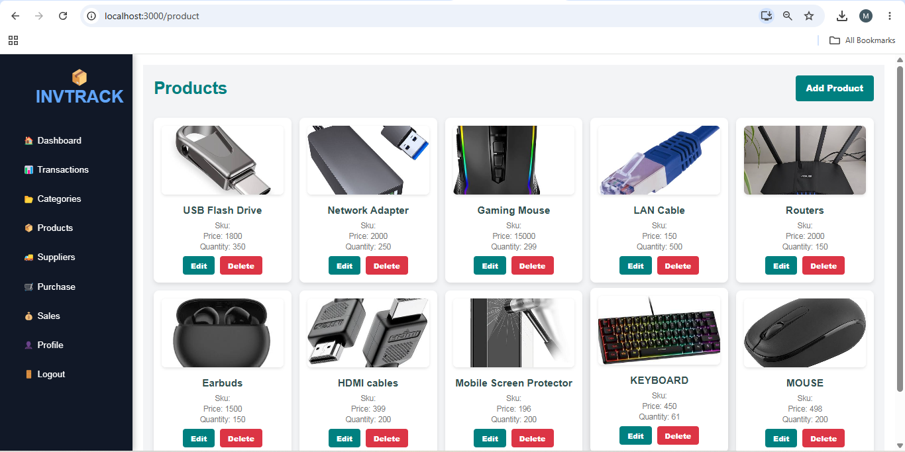
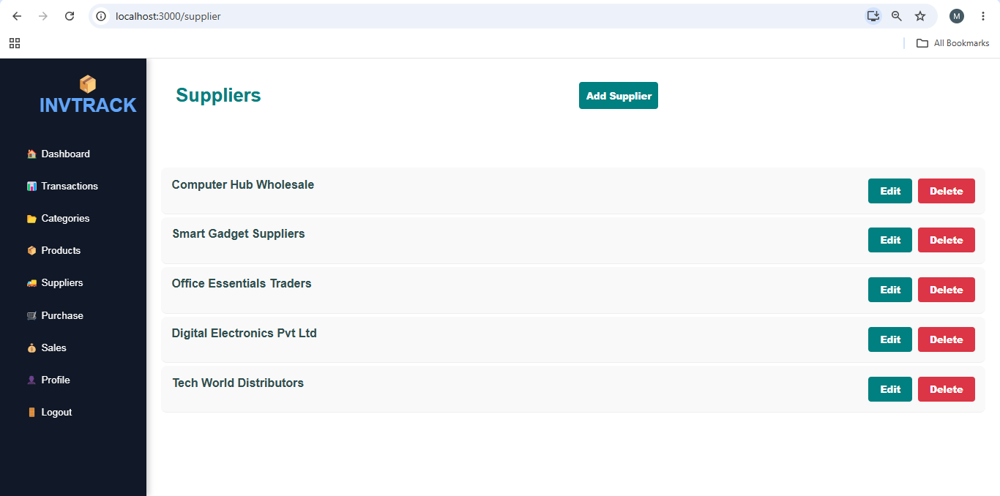
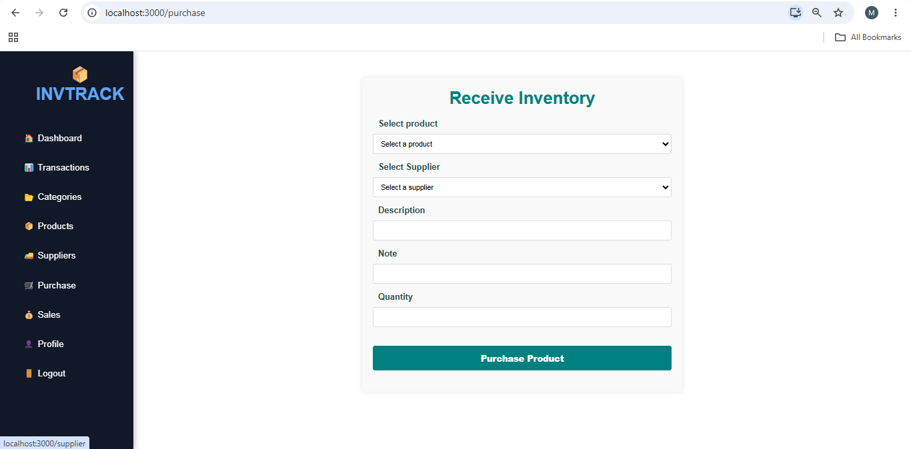
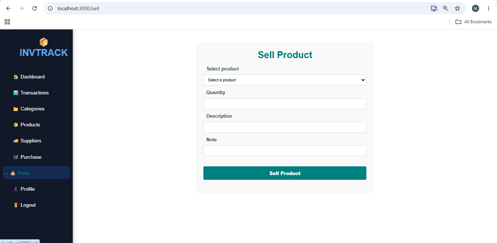
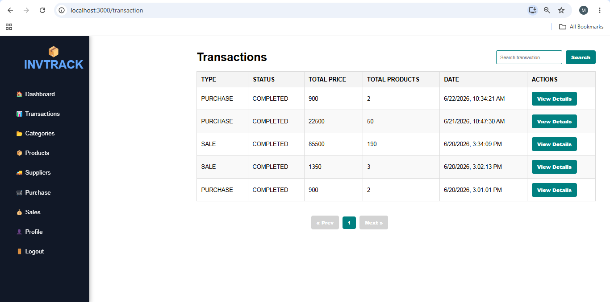

# IMS-react

# Inventory Management System

## Overview

A full-stack Inventory Management System built using React.js, Spring Boot, MySQL, and JWT Authentication. The system helps manage products, suppliers, purchases, sales, and inventory transactions with a modern dashboard and role-based access control.

## Features

* JWT Authentication
* Role-Based Access Control (Admin & Manager)
* Product Management
* Supplier Management
* Purchase Management
* Sales Management
* Transaction Tracking
* Dashboard Analytics
* Inventory Monitoring
* Product Image Upload

## Tech Stack

### Frontend

* React.js
* CSS
* Recharts

### Backend

* Spring Boot
* Spring Security
* JWT Authentication
* REST APIs

### Database

* MySQL

## Screenshots

### Dashboard



### Categories



### Products



### Suppliers



### Purchase



### Sales



### Transactions



## Installation

### Backend

```bash
cd backend
mvn spring-boot:run
```

### Frontend

```bash
cd frontend
npm install
npm start
```

## Author

Monica V

